How To modify whole channel lists of a modified PRM8060 or PRM8070 transmitter
==============================================================================

Please ensure, that you have installed the firmware (V5.0 or higher) from
[sourceforge](https://sourceforge.net/projects/prm80/files/prm80%20firmware)
 
* Connect radio to PC via serial interface or USB2serial adapter. 
More information in regard to hardware connection see 
[Computer_control.md](../doc/Computer_control.md)

* Start terminal software at PC, e.g. Tera-Term

Tera Term Port configuration:
-----------------------------
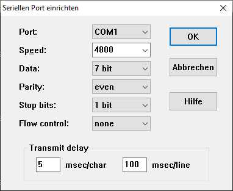

Ensure that settings are done correctly. It is very important to adjust Transmit delay to 5ms/char, 100msec/line, 
else you will not be able to send a higher amount of data to the PRM80 (e.g. channel list). If you still get in trouble with numbers above, increase the numbers and re-test 

Tera Term Terminal Configuration:
---------------------------------
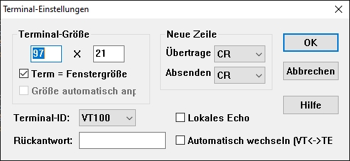

Ensure that 'new line' is configured to 'Carriage ReturÅh (CR)'.
Disable Local Echo. To start the communication to the PRM80xx it may be necessary to Reset the Terminal (Control Menu -> Reset Terminal)

If you can see following screen after entering a 'H', the communication from PC to PRM80xx is running well:
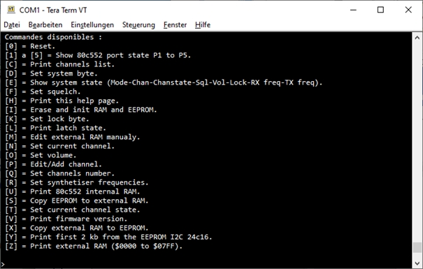

Read the channel list from PRM80xx:
------------------------------------
Press 'C'
Copy the received data to a text file, e.g. input.txt:
Channel Frequency Shift State
00 894E 0260 01
01 8952 0260 01
02 8973 02F0 01
03 8946 0260 01
04 8952 0260 01
05 866C 0000 00
06 866E 0000 01
....
Now start Excel and:
File -> open -> search -> Text Files (*.prn;*.txt;*.csv) -> input.txt
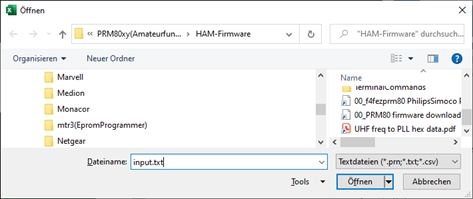

-> Select separated

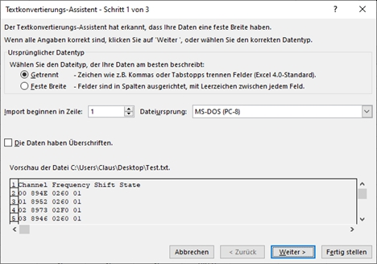

-> next

-> select Space (Blank/Leerzeichen) as separator

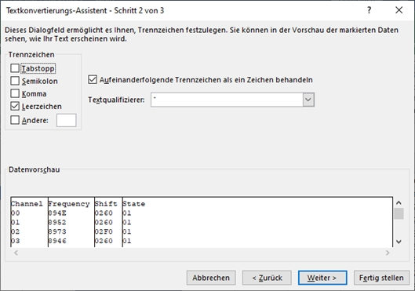

-> next

-> mark all columns and select Text

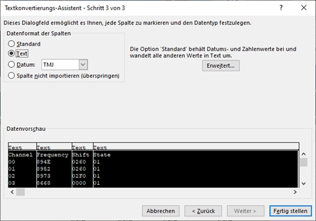

->  finish

If your Excel Sheet looks like:

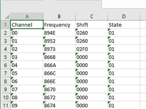

The import step is done correctly

Now select all data and copy

Open file 'ChannelListFromToPRM.xlsx'

-> goto TAB 'Input(RAW)'

-> select field A1

-> and paste the data via 'paste content -> values only'

.jpg)

Now go to TAB 'freq(Input)'
Here you can find all data received from PRM80.

Don't change any values inside this TAB !!

.jpg)

Again: mark all values and copy:

_marked.jpg)

->  goto Sheet Freq(Edit) -> Mark field A1 -> and again paste contents (values only)

Now you can modify frequencies, State bitsÅc as needed.

If you are finished, goto TAB ÅgOutputÅh and save this sheet (only) as text document:

File -> Save as ->  select folder -> formatted text (blank separated) ->  Output.txt

If you open the stored Output.txt file with a text editor, 
the result should look like:

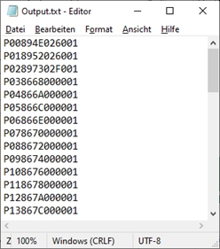

If not, you can not send the data to the PRM80xx, instead you have to look what went wrong

If the result was fine you can send the new config Data to the PRM80xx via Tera Term (or similar software).

TeraTerm: File -> Send data -> Output.txt -> open

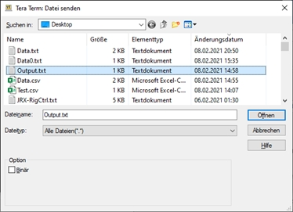

Now you should see that all channel are send to the PRM. Double check that no data are missing !

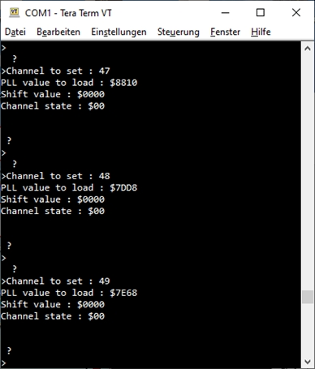

If you want have the data stored to the EEPROM, Press the ÅgXÅh button after all data have been sent.
Now you are done with
* Download channel list from PRM80xx
* Modify channel list
* Upload channel list to PRM80xx

This workaround is available as long as no other configuration software is written/available for this radio.

