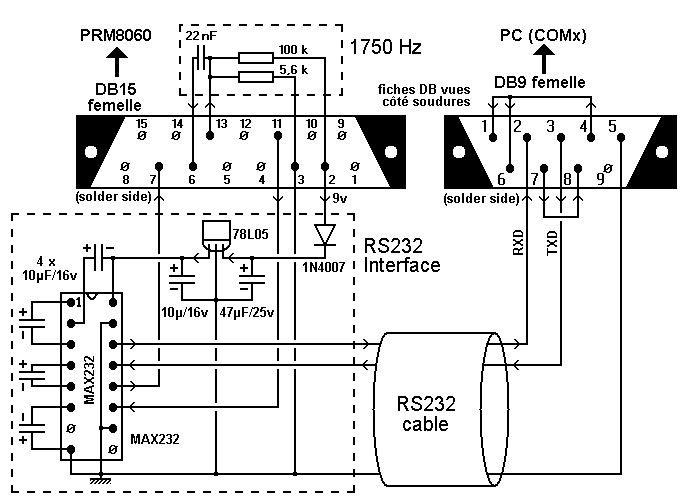

Interface
=========
Details of the modification to add the 1750 Hz tone for repeater command come from the serail interface diagrams (Do not take care about the RS232 stuff)

This requiere few components and can take place is the plug enclosure.

Use
===
The simple way to use the 1750 Hz tone is to push the command button from the device face when the radio is in TX mode. On the PRM8060, the single right button is used.

Optionaly, It is possible to modify the microphone. The original microphone has an ILS
type contact (detects the presence of the microphone on its attachment). This type of contact is
taken out and replaced by a push button used for the tone.
