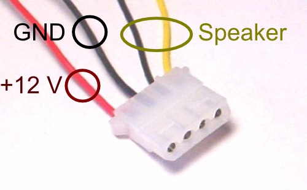
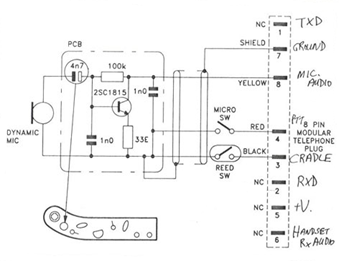

Power and Speaker
=================

The power in 13,8V and the connections of the loudspeakers are made through a Molex plug. It is the same type of plug as for the power plug of IDE CD drives and IDE hardrives in a compatible PC, thus, if the original cable were to be missing, it si possible to get one on an old power supply of a PC.

Mike
====

The front face have a unique RJ45 plug designed for the mike. This plus is commonly used in computer networks.Outside of the signal of the microphone and the PTT, a power box is designed for an accessory. It should be noted that the original microphone has a transistor for pre-amplification. The pin for the signal « mike hang up » is derouted for the  command of a frequency of 1750 Hz (see modification lower).

Accesories DB15
===============
A DB15 connector for the accessories is also found on the back face, it is used to generate the 1750 Hz, and the connection to a computer. The pins for this plug are the following :

Pin Nb | Description
------ | ---------------------
 1     | Non regulated power 13,8V
 2     | Regulated power 9V
 3     | GND
 4     | Mike signal
 5     | GND
 6     | Transmission audio in
 7     | RXD
 8     | Alternate (PTT)
 9     | Reception FM out
10     | Reception audio out
11     | TXD
12     | Alarm in (not used)
13     | Generation of  the1750 Hz tone
14     | Loudspeaker mute
15     | Loudspeaker audio out

Internal DIL 20
===============

On the back of the CPU board, there is a 20 pins connector going to the DB15 plug. Since the number of pins is diferents, some signals are missing on the DB15. This is the description found by F8EGQ:

Pin Nb | Description
------ | ---------------------
 1     | Reception FM out
 2     | Reception audio out
 3     | TXD
 4     | Alarm in (not used)
 5     | Generation of  the1750 Hz tone
 6     | Loudspeaker mute (TDA1519A pin 8)
 7     | Loudspeaker audio out
 8     | ???
 9     | ??? Mute detection ???
10     | 1MHz clock ???
11     | RX mute output
12     | System mute ???
13     | Alternate (PTT)
14     | RXD
15     | Transmission audio in
16     | GND
17     | Mike signal
18     | GND
19     | Regulated power 9V
20     | Non regulated power 13,8V

BNC
===
Should I explain what the BNC is used for ?