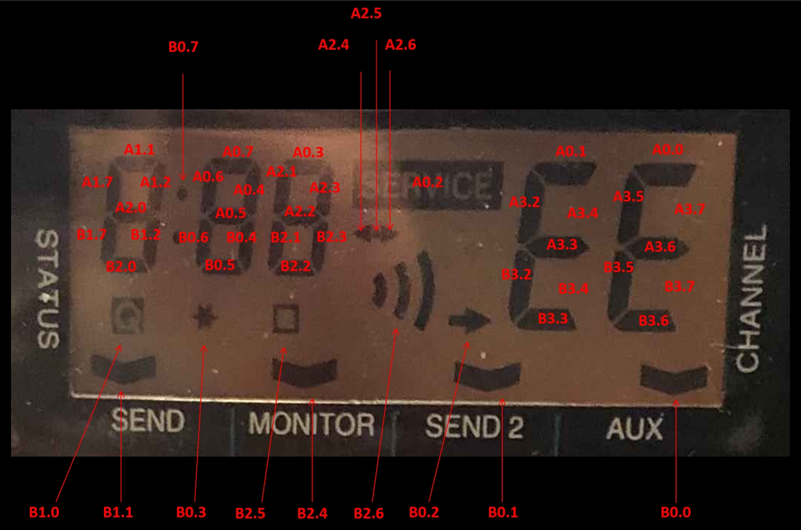

Assignment of Display Segments to register Bits
===============================================
The LCD display driver contains of 8 Register.
A0, A1, A2, A3, B0, B1, B2 and B3
 
The assingment of Bits to the related display segments is shown in picture "DisplaySegments.jpg.

The Firmware of the transeiver contains 5 look up tables, one table for each number digit.
