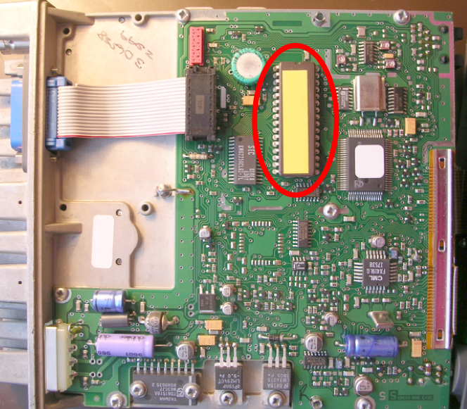

First it is necessary to disassemble the front end : it is maintained by a nut located behind the plastic button ot the potentiometer and a screw on top of the microphone plug. The little flat ribbon is very fragile,it should be taken off with extreme caution.With the help of a little screwdriver it is necessary to unlock  the plastic bearing that maintains the flat ribbon in place.
The second step consists of taking away the plastic protection box, it can eventually be maintained by screws on the side of the apparatus. Once bare, the logic card is visible from above, the card is protectected under shielding on the other side. The component to be changed is indicated on the picture on the right. It is to be extracted with the help of a little screwdriver doing a delicate lever so as not to bend the pins. Be carefull to respect the proper orientation of the component while replacing it (on the picture the first pin is on the side of the green capacitor). You just have to put everything back together and to connect the power, the loudspeaker and the microphone.

