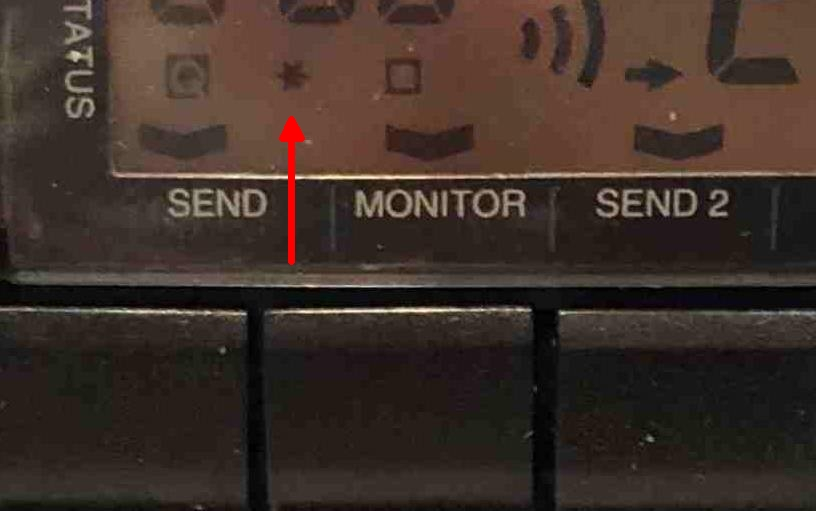

Introduction
============
The PRM8070 is a truncking radio. 

This device use the same radio and cpu board as the [PRM8060](PRM8060.md). The front board is composed of a 2+3 digits LCD, a volume control potentiometer and  8 push buttons.

Squelch and Volume
==================
The right up and down keys allow mainly to change the channel. A long pressure for fast mode.

Switching to squelch level is done by a short push on the squelch button (left SEND button below display). Another press of this key, return to channel mode. 
The squelch mode is indicated by a 'v' on the LCD, directly above the button.
The squelch level can be changed throught the up and down keys (Same as channel) from 0 to 15.

Setting the volume is done through the potentiometer, turning the device on by a pressure on
the latter.

Scanning
========
Channel scanning can be started by pressing the "Monitor" button. When the squelch is open, the scanning is holded until the squelch is not closed again. To stop the scanner, the scan button should be pushed again. Pressing the PTT also stop channel scanning. 
 
Any channel can be locked out of scanning when programming (see [Computer control](Computer control.md) ) or via pressing the "Monitor" button for more than 1 sec. A channel which was locked for scanning can be identified via the "v" symbol above the "Monitor" button.

Working on repeaters / split frequency
======================================
When a small arrow (left/right orientation) is present in middle of the display, the selected channel is configurated with a TX frequency different from the RX one 
If the split frequency is negative (Tx frequency is lower than the Rx frequency), a left arrow is displayed, a positve split frequency is marked with a arrow to the right.

With a long preasure (~1sec) to the SEND2 button the shift between RX and TX can made positiv/negativ/0.
With a short preasure to the SEND2 button the reverse function will be activated.
That is to inverse the frequency of transmission and reception: a star appears at the lower left side of the display, when the transceiver works in reverse mode. 

  

A channel specific split frequency can be programmed to the PRM8070 via serial Interface  ("P" command), see [computer interface](Computer_control.md)
The split frequency is displayed with the left three digits, first digit means Mhz (right picture: channel 3, 7,60 Mhz negative shift) 

If the [1750 Hz tone modification](1750Hz_tone.md) has been done, a 1750 Hz can be transmitted by pushing simultaneously on the PTT button and on the command button of the 1750 Hz of the microphone. 
It is also possible to activate the tonality by pressing the reverse button of the front end, while the radio is transmitting (PTT pushed).

Commuting the power
===================
A short push of the right key lower key (AUX) allows to shift the power level. When the power is on « high », the symbol "v" is above the button.

Reset
=====
Resetting can be achieved if necessary, the factory parameters of the transciever are back in function. This function is automatically done when the new eprom is put into use. To manually force the zero setting, you have to press simultaneously the right up and down keys when the transciever is connected again to the power, during this procedure there is a signal coming out of the loudspeaker.

RSSI indicator
==============
To display the strength/level of the received signals: 

The « Squelch/SEND » and « reverse/AUX » buttons must be pressed at the same time. The given value is in hexadecimal format. To go back in the normal mode, press again the two keys.
