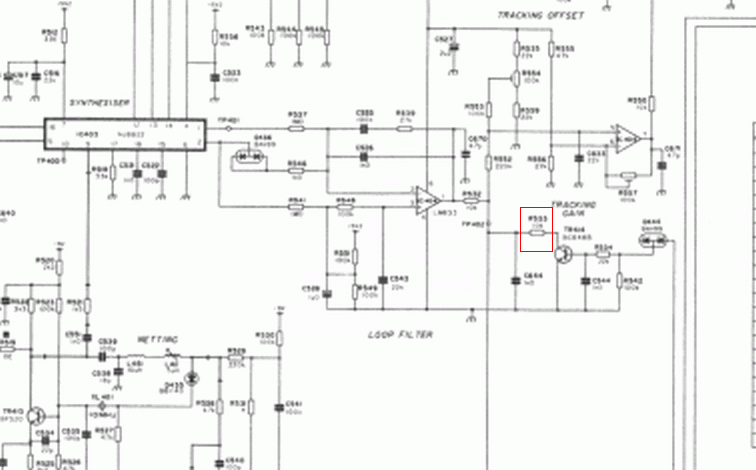
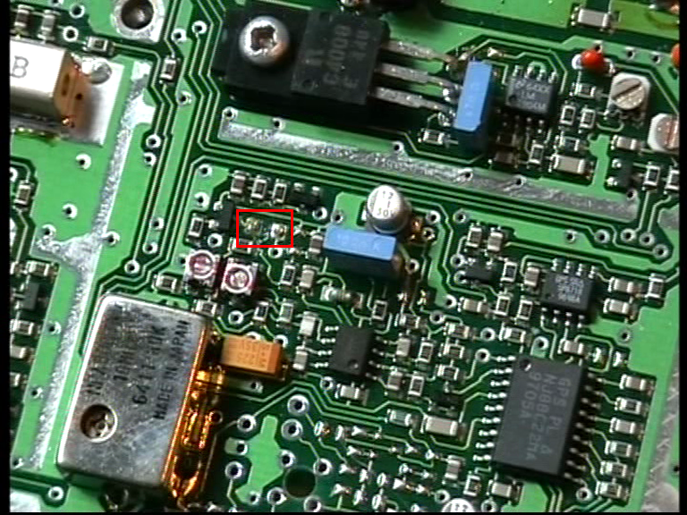
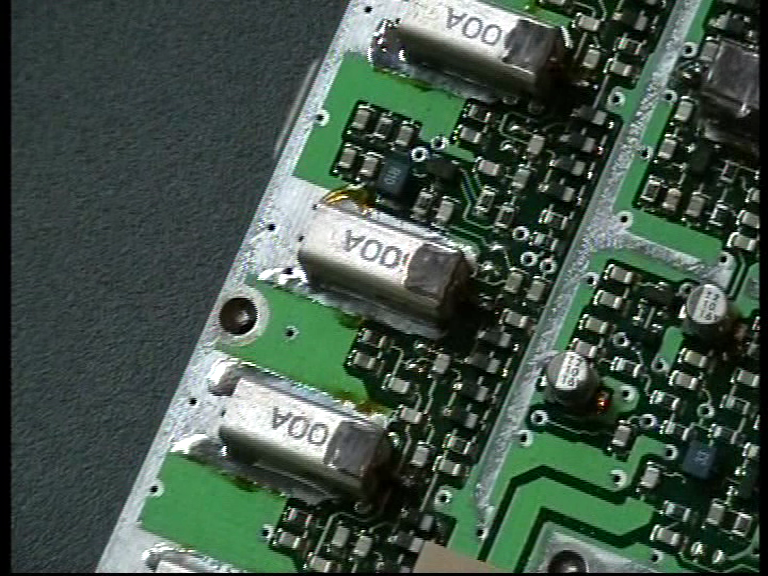
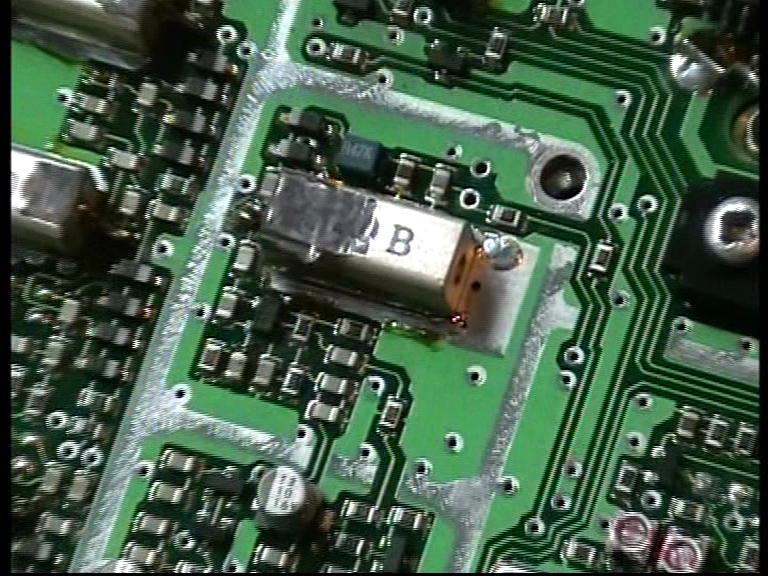
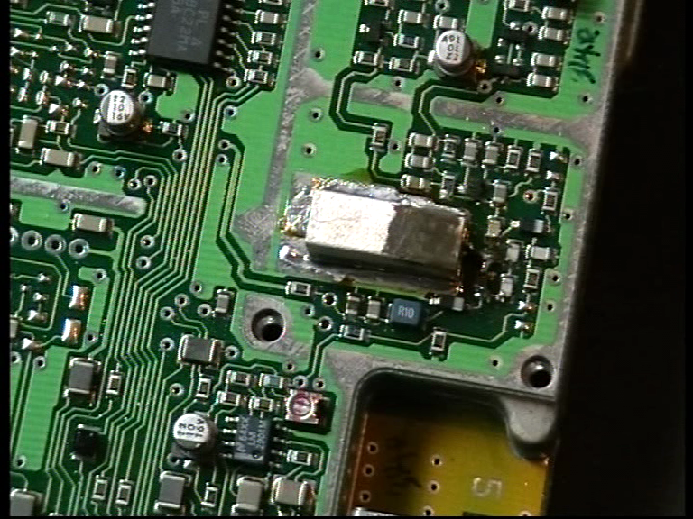

Like the [TZ](TZ.md) version, to modify the frequency range, the DROs must be drilled. As explained by [Dan](http://pmr446romania.blogspot.com) a resistor should be also removed. 

Here some photos from him :

