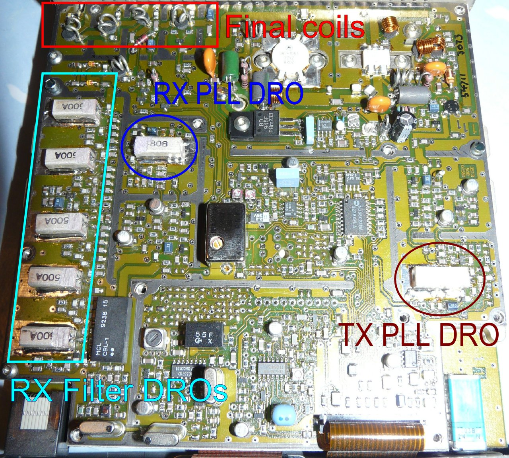
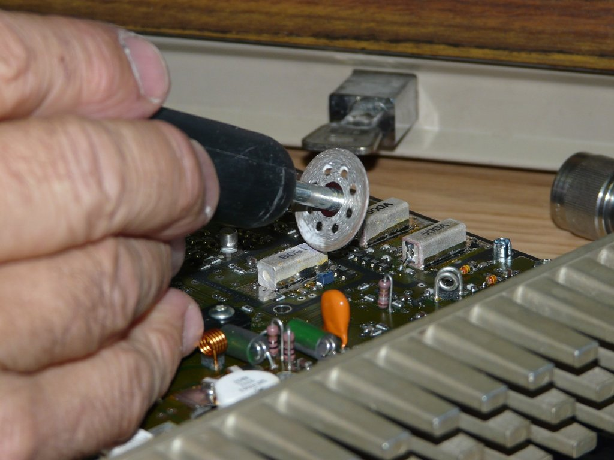
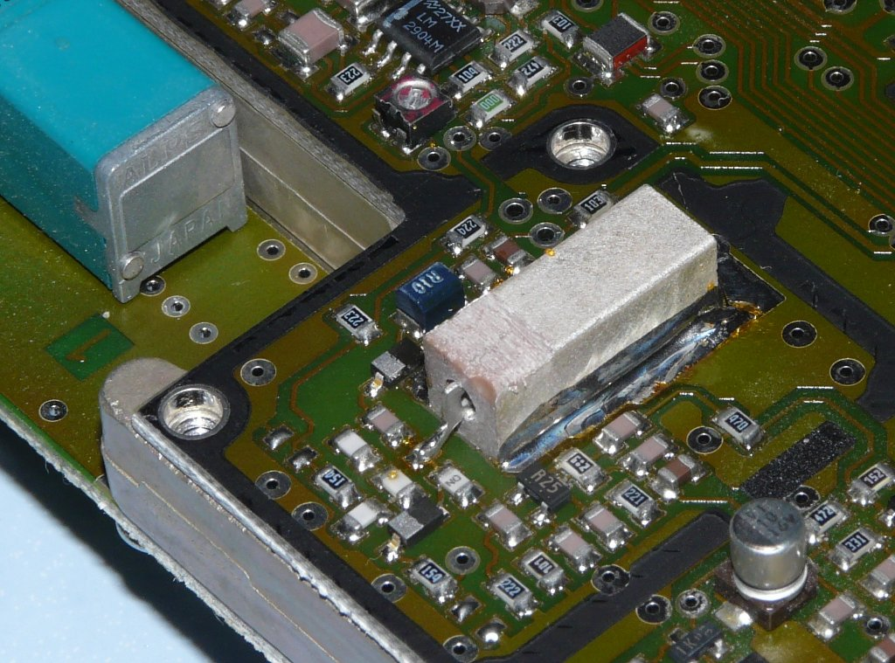

The STZ version is not easy to adapt to the ham band since the original frequencies are not closed to the target band. UHF PRMs use DRO, they can be asjusted by grinding but they are particulary sensitive.

The first thing to do is to program an EPROM with the correct firmware (_430 suffix). After startup, "EE" is printed instead channel digits, this mean that the PLL can't lock. For the following, the RS232 interface can also help the modifications by programming directly the PLL word.
Thanks to F1AIA for the work !

About DRO tunning
=================
DRO (Dielectric Resonator Oscillators) are made for a specific frequency like Quartz. To change their charateristics, use a mini drill to remove a thin coat of metal. But take there are very sensitive.

To increase the frequency, grind the top face from pin (Take care about the direction).
On this device 5mm should be enouth to work up to 437MHz. DON'T grind too much if you don't want to see the Q factor decreasing too low!

RX PLL DRO
==========
For this step, it is easier to work with the PRM80 turned on. So take care about short circuit !
* Set up an intermediate frequency like 425MHz or 428MHz from the terminal.
* Start to grind the surface of the RX DRO from the pin face and check from on the terminal that the PLL lock now.
* Set up the you desired frequency. 437MHz should be fine.
* Continue to grind the DRO to lock on the final frequency. Should be something arround 5mm.
* Play also on the PLL voltage during this exercice.

RX Input filter DROs
====================
* Inject a frequency of 432MHz from a HF generator, something about -100dB. Control with a good resolution the RSSI signal (good voltmeter or oscilloscope).
* Grind the 5 DROs (One by One) of the input filter and try to increase the RSSI signal. If you grind too much, the signal strength reduce. 

At final we have obtained a sensibility of 2µV.

TX PLL DRO
==========
Grind the TX DRO about the same surface as the RX one.

TX Output filter
================
With a power meter connected to the output, spread a bit the final coils to have the maximum power. 

We obtained 8.5W
