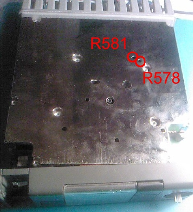

The transmitter allows you to choose between two power levels: low or high.

The case on the radio side has two holes to adjust the power with the help of a little special isolated screwdriver. 

SA9 devices
===========
In high power, the  PRM can deliver up to 30W. Yet it is safer not to exceed the 25W recommanded by the manufacturer.

* R578 : Low power
* R581 : High power

